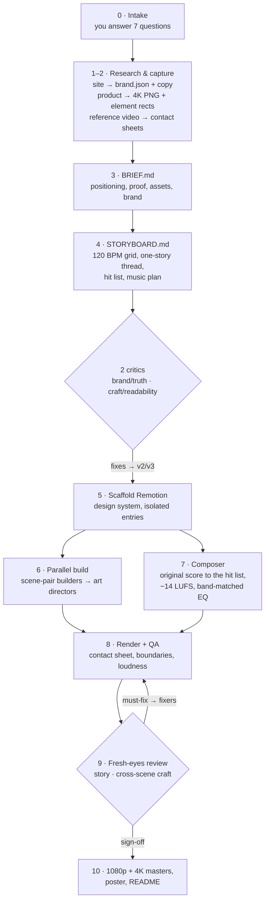

# launch-film

**A Claude Code skill that turns a company's website and live product into an expert-grade product launch film.** It doesn't stop at a template clip. It runs the whole pipeline a top motion studio would, using real 4K product captures and an original score composed to the cut:

- research → storyboard → adversarial critique;
- parallel scene build;
- original synced score;
- multi-agent QA;
- 1080p + 4K masters.

```text
"Make a 60-second launch film for Acme (acme.com). Use our public demo at demo.acme.com."
```

Claude asks you a short intake, then works for a few hours (mostly autonomously) and hands back:

| Deliverable | Spec |
|---|---|
| `out/<name>.mp4` | 1920×1080, 30 fps, H.264 CRF 16, AAC 320 kbps, **−14 LUFS / ≤ −1 dBTP** |
| `out/<name>-4k.mp4` | 3840×2160 master (UI stays crisp: product captures are 4K) |
| `out/<name>-poster.png` | poster / thumbnail frame |
| `public/audio/score.wav` | the original score stem, 48 kHz / 24-bit, exact film length |
| `STORYBOARD.md`, `BRIEF.md`, `README.md` | locked shot list + hit list, production brief, re-render guide |
| editable source | one React file per scene (Remotion) and the score script (Python) |

---

## How it works



| Phase | What happens | Key technique |
|---|---|---|
| **0 Intake** | Claude asks for your company, URL, product footage source, the ONE outcome to follow, approved proof, CTA, plus optional brand/style/audio prefs | [`references/intake.md`](skills/launch-film/references/intake.md): required vs optional, with defaults |
| **1–2 Research & capture** | Playwright captures the site (screenshots, CSS tokens → hex, fonts, logo SVGs, copy) and the product (every story state at 2× DPR plus **bounding boxes of every element**); reference videos become 1 fps contact sheets plus a transcript | rects JSON lets builders aim push-ins and focus rings precisely; blank/typed capture pairs give pixel-exact typing |
| **3–4 Brief & storyboard** | Positioning, proof with sources, asset inventory; a beat-locked 60 s storyboard with exact copy, times, assets, hit list and music plan | 120 BPM: beat = 15 frames, section changes on bar lines; ≥ 0.35 s/word readability; one metric followed end to end |
| **Critique** | Two adversarial critics (brand/truth, craft/readability) before a single frame is built | catches stitched stories, overclaims, unreadable captions, wrong captures |
| **5–6 Build** | Remotion project with a shared design system; scenes built in parallel by "builder" agents, then reviewed and fixed by "art director" agents | isolated per-scene entry points, so one broken scene can't break others; a fast stills tool for frame-accurate checks |
| **7 Score** | Original music composed to the hit list: every word pop, click and number landing has a sound at the exact sample | mastering to −14 LUFS / −1 dBTP; octave-band matching against a pro mix fixes the "too bright synth" problem |
| **8–9 QA** | Full render; contact sheet, boundary frames, loudness; two fresh-eyes reviewers watch the **rendered MP4**; fixers apply must-fixes in parallel | "dip" hand-offs (no double-exposed text), shared base backdrop (no brightness collapse) |
| **10 Deliver** | 1080p + 4K + poster + README, with an honest list of what you must check (listen to the score, confirm claim permissions) | |

## Install

**Claude Code plugin (recommended):**
```text
/plugin marketplace add Anann99/launch-film-skill
/plugin install launch-film@launch-film
```

**Any agent that supports Agent Skills** (via the [`skills`](https://github.com/vercel-labs/skills) CLI):
```bash
npx skills add https://github.com/Anann99/launch-film-skill --skill launch-film
```

**Manual:**
```bash
git clone https://github.com/Anann99/launch-film-skill
cp -R launch-film-skill/skills/launch-film ~/.claude/skills/launch-film
```

## Use

Ask in plain language, e.g. *"make a launch video for our product"* or *"turn acme.com into a 60-second launch film"*. You can also invoke `/launch-film` directly.

### What Claude will ask you (have these ready)

**Required:**
1. **Company / product name**, with exact spelling and casing.
2. **Website URL.**
3. **One-line description, and who the film is for** (e.g. "Heads of Growth at consumer apps").
4. **Where product footage can come from:** a public demo URL, a sandbox login, screenshots or screen recordings. **And what must never appear** (customer data, internal tools, unreleased features).
5. **The ONE outcome the film follows:** the metric or result your product moves, ideally one metric on one surface.
6. **Proof you're allowed to publish:** customer names/logos plus numbers with links. Also say which numbers must *not* be shown.
7. **Call to action:** the URL and button text ("Book a demo", "Start free").

**Optional (sensible defaults are used if you skip them):**
- phrases to use/avoid, competitors;
- brand assets (logo SVG, colours, fonts);
- style references you love or hate;
- length (60 s);
- aspect (16:9 + 4K);
- audio (music-only, original score; or your licensed track; or voiceover);
- tone;
- where it will be shown;
- deadline and legal lines.

A copy-paste version of the questionnaire is in [`references/intake.md`](skills/launch-film/references/intake.md#copy-paste-version-for-the-user).

## Requirements
- Claude Code (or another agent with Agent Skills support).
- **Node.js ≥ 20**, **FFmpeg** with libx264 on `PATH`.
- **Python ≥ 3.10** for the score:
  ```bash
  python3 -m venv .venv && .venv/bin/pip install numpy scipy pedalboard soundfile pyloudnorm pillow
  ```
- **Playwright Chromium.** It's installed by the template: `npm i && npx playwright install chromium`.
- Optional: **whisper-cpp** + a ggml model, to detect voiceover in reference videos.
- **Time and cost:** a 60 s film takes a few hours. With the multi-agent stages it uses several million tokens. The single-agent route is slower but cheaper.
- **Platforms:** developed on macOS; the scripts are POSIX shell, Node and Python.

## Guardrails built in
- **Truth.** Only claims you approved or that are published (with sources). Demo/sandbox numbers may appear inside UI shots but never as headline type or as a customer result. Customer logos require permission.
- **Privacy.** Public demo or sandbox tenants only, never real customer data, PII, keys or internal URLs. Non-essential cookies are declined during capture. Claude never types your passwords; if a login is needed, you log in yourself or provide a sandbox session.
- **Readability.** ≥ 0.35 s per word fully visible; at most 2 caption lines; key UI text ≥ 20 px on screen.
- **Honesty.** The score is verified by measurement (loudness, true peak, sample-exact sync, spectrum). Claude tells you to listen to it before release.

## Repository layout
```text
.claude-plugin/              plugin.json + marketplace.json (Claude Code plugin)
skills/launch-film/
  SKILL.md                   the skill: phases, rules, commands, quality bar
  references/
    intake.md                the questionnaire (asks for the user) + defaults
    brief-template.md        BRIEF.md template
    storyboard-template.md   storyboard format, 30/60/90 s shapes, worked example
    build-guide.md           rules for parallel scene builders
    agent-prompts.md         critic / builder / composer / art-director / reviewer / fixer prompts
    workflows.md             optional multi-agent Workflow scripts
    audio.md                 composing, mastering, sync verification, tonal matching, licensed tracks
    review-checklists.md     storyboard, scene and release checklists
    pitfalls.md              everything that went wrong once, and the fix
  scripts/
    capture-site.mjs         site → screenshots, brand.json (CSS tokens + hex), copy.txt, logos
    capture-product.mjs      product → 4K captures + element rects (explore + config modes)
    contact-sheet.py         labelled image grids for agents
    analyze-reference.sh     reference video → contact sheets, cuts, loudness, transcript
    band-match.py            tonal balance vs a reference mix + EQ suggestions
  template/
    video/                   Remotion 4 project: design system + primitives (kinetic pill type, 3D app windows,
                             camera over 4K captures, spotlights, dashed connectors, brand-mark draw, cursor),
                             scenes.json → scaffold.mjs (timeline, stubs, isolated entries), Main.tsx hand-off
                             grammar, tools: stills / mainframes / boundaries / qa.sh
    audio/                   synth.py (instrument kit) + compose.py (arranger, master, verify, viz) + score.json
```

## Customising the template
- **Brand:** `video/src/design/tokens.ts` holds palette roles; fill them from `brand.json`. Also set `fonts.ts` (Google Fonts or local files) and `logo.ts` (SVG path data for the draw-then-fill logo animation).
- **Timeline:** edit `video/scenes.json` (id, start, end, title, hand-off), then run `node tools/scaffold.mjs`. It never overwrites real scene files.
- **Score:** edit `audio/score.json` (sections with chords and energy, silences, hits), then run `python audio/compose.py`. Set `"music": false` to render only sound design over a licensed track.

## Licensing notes
- This repository is **MIT**-licensed.
- **Remotion** has its own licence: it's free for individuals and small companies, and larger for-profit organisations need a company licence. Check [remotion.dev/license](https://www.remotion.dev/license) before commercial use.
- Fonts loaded via `@remotion/google-fonts` follow their Google Fonts licences (mostly SIL OFL).
- **Your captures, logos and paintings/photos from your site are your content.** Only use material you have rights to, and customer logos with permission.
- The synthesized score is original output of the included code. If you supply a licensed track, its licence governs.

## Credits
The pipeline was developed and battle-tested while producing a 60-second, music-only launch film for a B2B AI company with Claude Code. Every pitfall in [`pitfalls.md`](skills/launch-film/references/pitfalls.md) happened at least once.

Built with [Claude Code](https://claude.com/claude-code), [Remotion](https://www.remotion.dev), [Playwright](https://playwright.dev), FFmpeg, NumPy/SciPy, [pedalboard](https://github.com/spotify/pedalboard) and [pyloudnorm](https://github.com/csteinmetz1/pyloudnorm).
